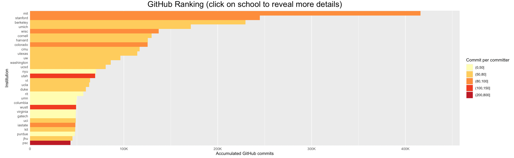

# GitHub-Based University Ranking (g-index)

## About

We propose g-index (GitHub index) to rank US universities according to their open source contributions. Data is gathered using Google Big Query's public data warehouse "github-repos" and updated monthly.

Website: https://hxu296.shinyapps.io/g-index/

## TOP 30 U.S. Academic Institutions
1. mit
2. stanford
3. berkeley
4. umich
5. wisc
6. cornell
7. harvard
8. colorado
9. cmu
10. utexas
11. uw
12. washington
13. ucsd
14. nyu
15. utah
16. vt
17. ucla
18. duke
19. rit
20. umn
21. columbia
22. wustl
23. virginia
24. gatech
25. uci
26. iastate
27. kit
28. purdue
29. jhu
30. psc
